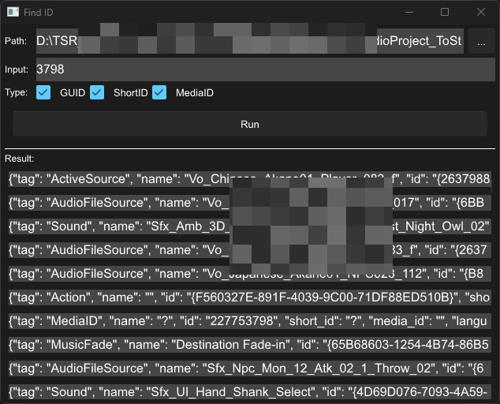

# 📘 `find-id`

`find-id` 是一个 Wwise ID 搜索工具，用于在 Wwise `.wwu` 文件中查找包含指定 ID 的节点，支持按 `MediaID`、`GUID`、`ShortID` 三种模式搜索。

---

## 🛠️ 功能特点

* ✅ 并行处理：使用 [Rayon](https://docs.rs/rayon/) 加速多文件遍历和查找
* ✅ 多种搜索模式：支持 `MediaID`、`ID (GUID)`、`ShortID`
* ✅ 自动验证目录结构（需包含 `.wproj` 文件）
* ✅ 中文注释 + 用户友好输出格式

---

## 📦 下载

[下载地址](https://github.com/xmimu/find-id/releases)

---

## ▶️ 使用方法

1. 点击 ... 按钮选择 `.wproj` 文件。
2. 输入要搜索的 ID。
3. 选择搜索模式。
4. 点击 `开始搜索` 按钮开始搜索。

## 📚 依赖库

* [clap](https://docs.rs/clap/) - 命令行参数解析
* [glob](https://docs.rs/glob/) - 通配符文件匹配
* [rayon](https://docs.rs/rayon/) - 数据并行处理
* [roxmltree](https://docs.rs/roxmltree/) - XML 文档解析

---

## 📜 License

本项目采用 MIT 协议，欢迎自由使用与修改。

---
